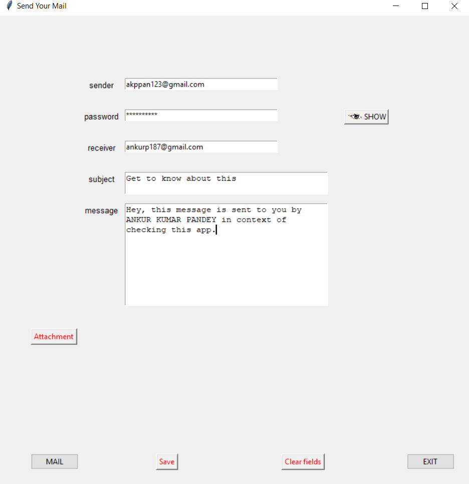

# py_mail-app

## This is a mailing app in python

You can send mail using this and you can save your mail to a file using the save button.
Only you have to on the less secure apps feature for your mailing account so that it can be accessed by the python program.
You can do this from https://myaccount.google.com/lesssecureapps?pli=1 link.

It has a feature as provided by windows for the password input and the show and hide password attribute through event triggering.

You can send your attachments as well.

### **The Main Window**

The save button will help you saving your message.

### **The Attachment Window**

